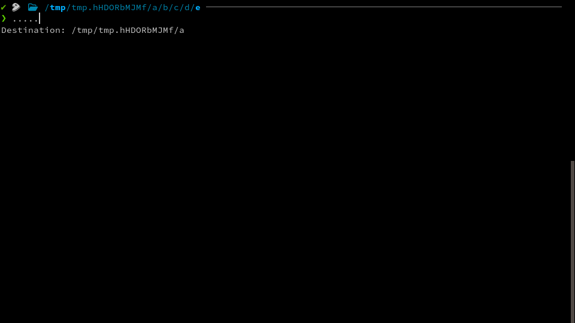

# `zsh-dot-up`

`zsh-dot-up` is a zsh plugin that converts `...`, `....`, `.....`, etc., into `cd` commands to navigate parent directories.

## Installation

### [zplug](https://github.com/zplug/zplug)

```zsh
zplug "toku-sa-n/zsh-dot-up"
```

## Usage

Just type `...`, `....`, `.....`, etc., in your terminal. You'll see the destination directory below the command line. Pressing the Enter key will navigate to the directory.



## Highlighting

`zsh-dot-up` does not provide highlighting by default. If you want to highlight the `...`, `....`, `.....`, etc., commands, you can use the following settings with [zsh-syntax-highlighting](https://github.com/zsh-users/zsh-syntax-highlighting)

```zsh
ZSH_HIGHLIGHT_HIGHLIGHTERS+=(regexp)
ZSH_HIGHLIGHT_REGEXP+=('^\s*(\.){2,}$' fg=green)
```

## License

Copyright (C) 2024 Hiroki Tokunaga

This program is free software: you can redistribute it and/or modify
it under the terms of the GNU Affero General Public License as
published by the Free Software Foundation, either version 3 of the
License, or (at your option) any later version.

This program is distributed in the hope that it will be useful,
but WITHOUT ANY WARRANTY; without even the implied warranty of
MERCHANTABILITY or FITNESS FOR A PARTICULAR PURPOSE.  See the
GNU Affero General Public License for more details.

You should have received a copy of the GNU Affero General Public License
along with this program.  If not, see <https://www.gnu.org/licenses/>.
